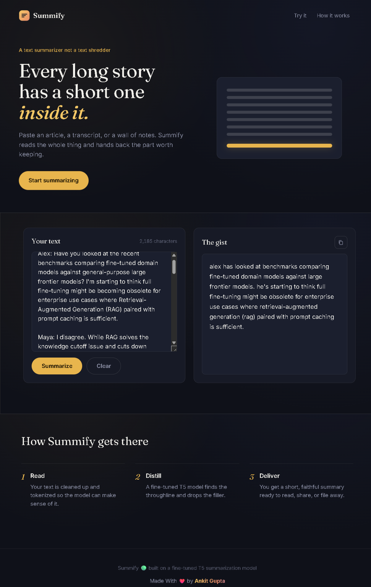

<div align="center">

# ***🟢 Summify***

### ***🤖 AI-Powered Text Summarization using Fine-Tuned T5***

***Summarize • Understand • Simplify***

<p align="center">

</p>

<p align="center">


</p>

<p align="center">
<a href="https://summify-35ok.onrender.com">

</a>
</p>

</div>

---

### ***🌟 About***

***Summify is an AI-powered text summarization application built with a fine-tuned T5 Transformer model.***

***It converts long-form text into concise, meaningful summaries through a simple web interface. The project demonstrates an end-to-end NLP workflow from model training and inference to FastAPI, Docker, and cloud deployment.***

---

### ***✨ What Summify Offers***

- 📝 Long-text summarization
- 🤖 Fine-tuned T5 Transformer model
- 🧠 Sequence-to-sequence NLP inference
- ⚡ FastAPI REST API
- 🎨 Modern dark animated UI

---

###  ***Live Demo 🌐: [Summify](https://summify-35ok.onrender.com)***


---

### ***📸 Preview***

```

---

### ***🧠 How It Works***

```text
                        USER
                         │
                         ▼
                ┌────────────────┐
                │   Summify UI   │
                │  HTML/CSS/JS   │
                └───────┬────────┘
                        │
                        │ HTTP POST
                        ▼
                ┌────────────────┐
                │    FastAPI     │
                │    Backend     │
                └───────┬────────┘
                        │
                        ▼
                ┌────────────────┐
                │    Tokenizer   │
                └───────┬────────┘
                        │
                        ▼
                ┌────────────────┐
                │ Fine-Tuned T5  │
                │     Model      │
                └───────┬────────┘
                        │
                        ▼
                ┌────────────────┐
                │ Text Generation│
                └───────┬────────┘
                        │
                        ▼
                ┌────────────────┐
                │    Summary     │
                └───────┬────────┘
                        │
                        ▼
                ┌────────────────┐
                │   Summify UI   │
                └────────────────┘
```

---


### T5 can be used for

- Text Summarization
- Translation
- Question Answering
- Text Generation
- Sequence-to-Sequence NLP tasks

---

# 🏋️ Model Training Pipeline

```text
                Dataset
                   │
                   ▼
            Data Cleaning
                   │
                   ▼
          Data Preprocessing
                   │
                   ▼
             Tokenization
                   │
                   ▼
            T5 Fine-Tuning
                   │
                   ▼
              Evaluation
                   │
                   ▼
              Save Model
                   │
                   ▼
             Model Inference
```

---

### ***🛠️ Tech Stack***

| Category | Technology |
|---|---|
| Programming | Python 3.11 |
| Deep Learning | PyTorch |
| NLP | Hugging Face Transformers |
| Backend | FastAPI |
| Server | Uvicorn |
| Frontend | HTML, CSS, JavaScript |
| Containerization | Docker |
| Deployment | Render |
| Development | Jupyter Notebook |
| Version Control | Git & GitHub |


### ***🎯 Use Cases***

Summify can be used for:

- 📚 Research papers
- 📰 News articles
- 📄 Long documents
- 🎓 Educational content
- 📝 Meeting notes
- 🔬 Research assistance
- 📖 Study material
- 💼 Business documents
- ⚡ Productivity workflows

---

### ***💡 Key Learning Outcomes***

This project demonstrates how to take an NLP model from experimentation to a deployable application.

### Machine Learning

- Dataset preparation
- NLP preprocessing
- Tokenization
- Transformer architecture
- T5 fine-tuning
- Model evaluation
- Model inference

### Software Engineering

- FastAPI REST API
- Frontend integration
- Docker containerization
- Cloud deployment
- API health checks
- Project structure


### ***🚀 Future Architecture****

```text
                         User
                          │
                          ▼
                   ┌─────────────┐
                   │ Summify UI  │
                   └──────┬──────┘
                          │
              ┌───────────┴───────────┐
              │                       │
              ▼                       ▼
         Text Input              Documents
              │                       │
              └───────────┬───────────┘
                          ▼
                   RAG Pipeline
                          │
                          ▼
                  Retrieval System
                          │
                          ▼
                ┌─────────────────┐
                │    T5 / LLM     │
                └────────┬────────┘
                         │
                         ▼
                      Summary
```


### ***📝 Example Input***

```text
Artificial intelligence has become an important technology across
healthcare, finance, education, manufacturing, and many other industries.
Organizations are using machine learning and deep learning systems to
automate repetitive tasks, analyze large datasets, improve decision making,
and create intelligent applications.
```

### Example Output

```text
Artificial intelligence is being used across industries to automate tasks,
analyze data, improve decisions, and build intelligent applications.
```

---


### ***📌 Notes***
Transformer model files can be large. If the trained model is too large for normal GitHub repository limits, consider:

- Git LFS
- Hugging Face Hub
- Cloud object storage
- Downloading the model during deployment

Do not commit large model files blindly if they exceed GitHub's file-size limits.

---


### ***⭐ Support***

If you find **Summify** useful:

- ⭐ Star the repository
- 🍴 Fork the project
- 🐛 Report bugs
- 💡 Suggest improvements
- 🤝 Contribute to the project

---

### ***👨‍💻 Developer***

<div align="center">

## ***ANKIT GUPTA 👦***

### ***AI Engineer • AI Backend Developer • GenAI & Agentic AI Developer***

***Building intelligent AI systems using***

***Machine Learning • Deep Learning • NLP • Generative AI • Agentic AI***

</div>

---

<div align="center">

## ***🟢 Summify***

### ***Read Less. Understand More.***

***AI-Powered Text Summarization using Fine-Tuned T5***

***Made with ❤️ by Ankit Gupta***

</div>
